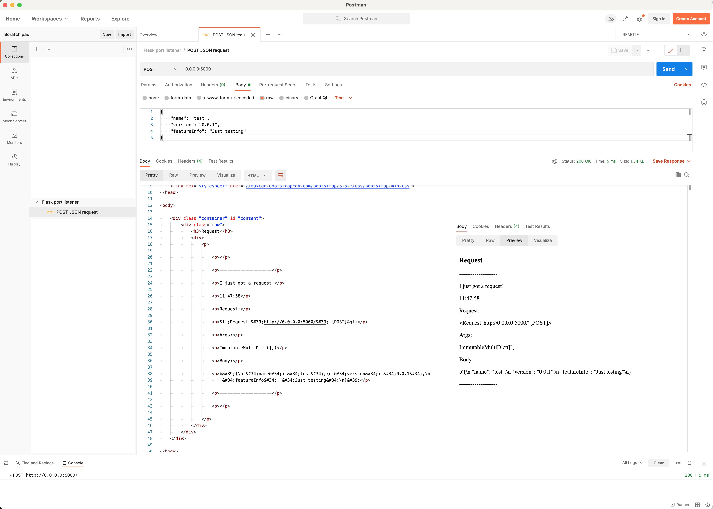

# Flask port listener

A simple tool for testing requests and ports locally, as well as on a remote server.

If you wish just to use the application use the following command:

```bash
docker run -p 0.0.0.0:8080:5000/tcp mikbuch/flask-port-listener:latest
```

where:
 * `8080` is the port exposed outside of the docker image (on a host machine)
 * `5000` is the TCP port inside the container on which the application is running

If you want to test different port than `8080` just replace it with the port you wish to test.

### Cleanup

First remove the container by image name, and then delete the image itself:

```bash
docker rm $(docker ps -a | grep 'mikbuch/flask-port-listener' | awk '{ print $1 }')
docker rmi mikbuch/flask-port-listener
```

Source of the idea for the `grep` command: https://stackoverflow.com/a/54099479/8877692

## Running the application

There are three cases of running _flask port listener_ covered here:
 1. Using docker-compose (via `Dockerfile`) `[server]`
 2. With virtual environment, using `pipenv` and command line interface `[server]`
 3. With virtual environment, using `PyCharm`'s `venv` and/or command line interface `[locally]`

In brackets `[]` there are suggested ways of running the application for a given case. Of course, you can, e.g., run the application on a server with `venv` or run it locally with `docker-compose` but here I present the optimal way of running (and/or developing) the application -- I don't cover all possible options.

### Running with docker-compose

Make sure that you have `docker` and `docker-compose` installed on your server.

Modify the contents of the `docker-compose.yml` file for defining the port you would like to use. __Note!__ For using port `80` you need `sudo` rights -- this option was not tested yet with `docker-compose` case.

```yaml
    ports:
      - '8080:5000'
```

where:

 * `8080` - is the port on which your application will be accessible outside of the `docker` container
 * `5000` - is the port that is used by the `Flask` application inside the `docker` container

Use the following commands to run the dockerized `Flask` application:

```bash
docker-compose up
```

#### One-line command

In order to run the application temporarily use the following 'one-line' commnad:

```bash
cd /tmp &&
  git clone https://github.com/mikbuch/flask-port-listener.git &&
  cd flask-port-listener &&
  docker-compose up
```

#### Docker cleanup

Using docker-compose:

```bash
docker-compose down
docker rmi flask-port-listener_flask-listener-mb
```

In order to remove the created docker image manually using `docker` command:
 1. Get container's ID (`docker container ls -a`)
 2. Stop the container: `docker stop <<container_id, e.g., '20405ff628c1'>>` 
 3. Remove by ID: `docker rm <<container_id, e.g., '20405ff628c1'>>`
 4. Get image name: `docker images`
 5. Remove the image (by name or ID), e.g.: `docker rmi flask-port-listener_flask-listener-mb`

Optionally, if you are not using it, remove the `ubuntu` image as well. Using the same workflow as above.


### Running in a virtual environment using `pipenv`

With this approach running the application on port `80` has already been tested.

#### One-line command (installing & running for the first time)

```bash
git clone https://github.com/mikbuch/flask-port-listener && \
  cd flask-port-listener && \
  sudo apt-get install python3-pip && \
  sudo pip3 install pipenv && \
  pipenv install --python $(which python3) && \
  sudo $(pipenv --venv)/bin/flask run --host=0.0.0.0 -p 80
```

After running the appliction on the server, open the browser and type the IP of your server. You should see the output such as:


#### Cleanup

In order to remove the application:

```bash
pipenv --rm && \
cd .. && \
rm -rf flask-port-listener
```

Note: sometimes there can be some `root` files created under venv dir (`/home/$USER/.local/share/virtualenvs/flask-port-listener-$XYZ-$ABCDE/`). In such cases you have to remove this venv directory manually with `sudo` command.

#### Re-running the application

On the server when the application was previously installed you can just run flask application.

If your virtual environment is already installed and you are just (re)starting the server (Flask application) use the below command:
```
sudo $(pipenv --venv)/bin/flask run --host=0.0.0.0 -p 80
```

Explanation (more explicit approach):
```
sudo /home/$USER/.local/share/virtualenvs/flask-port-listener-$XYZ-$ABCDE/bin/flask run --host=0.0.0.0 -p 80
```
Where:
  * `$USER` is your username (where virtual environment was created)
  * `$XYZ` and `$ABCDE` are hash codes for the directory of the virtual environment
  
#### Step-by-step installation with `pipenv`

First clone this repository to the remote server:
```
git clone https://github.com/mikbuch/flask-port-listener
cd flask-port-listener
```

You'll need `pipenv` to run this server in virtual environment.

But first, install pip3:
```
sudo apt-get install python3-pip
```

Then install pipenv:
```
sudo pip3 install pipenv
```

Now install virtual env:
```
pipenv install --python $(which python3)
```

In order to run the server at port 80 (HTTP) you have to use sudo.
```
sudo $(pipenv --venv)/bin/flask run --host=0.0.0.0 -p 80
```

Explanation (more explicit approach):
```
sudo /home/$USER/.local/share/virtualenvs/flask-port-listener-$XYZ-$ABCDE/bin/flask run --host=0.0.0.0 -p 80
```
Where:
  * `$USER` is your username (where virtual environment was created)
  * `$XYZ` and `$ABCDE` are hash codes for the directory of the virtual environment

### Running in a `venv` using PyCharm

A virtual environment with `venv` should be configured as part of this repository all you have to do is click "Run" -- the configuration: `Flask (app.py)`.

Alternatively, you can open a terminal in PyCharm. You should see something similar to this:

```bash
(venv) ➜  flask-port-listener git:(master) ✗ 
```

Then just run a `flask` command, e.g.:

```bash
flask run --host=0.0.0.0 -p 80
```

## An example response received

An empty request (what will you see in the terminal):
```
127.0.0.1 - - [20/Apr/2020 10:12:44] "GET / HTTP/1.1" 200 -

--------------------
I just got request!
10:12:44
Request:
<Request 'http://127.0.0.1:5000/' [GET]>
Args:
ImmutableMultiDict([])
Body:
b''
--------------------
```

With some parameters:
```
127.0.0.1 - - [20/Apr/2020 10:12:44] "GET /?some_param=3 HTTP/1.1" 200 -

--------------------
I just got request!
Request:
10:12:44
<Request 'http://127.0.0.1:5000/?some_param=3' [GET]>
Args:
ImmutableMultiDict([('some_param', '3')])
Body:
b''
--------------------
```

Example `POST` response received:
```
172.17.0.1 - - [23/Jun/2021 11:16:29] "GET / HTTP/1.1" 200 -

--------------------
I just got a request!
11:17:17
Request:
<Request 'http://0.0.0.0:8080/' [POST]>
Args:
ImmutableMultiDict([])
Body:
b'{\n    "name": "test",\n    "version": "0.0.1",\n    "featureInfo": "Just testing"\n}'
--------------------
```

## Development

### Building a docker image manually

If you wish to add your docker image to publish it on DockerHub you wish to have a nice name of your image, e.g., `flask-port-listener` instead of `flask-port-listener_flask-listener-mb` (when running the build with the `docker-compose` command). You then have two options. First, rename `flask-port-listener_flask-listener-mb` manually, and the second: build the image using:

Tag naming convention: the newest numerical version and the `latest` tag are the same.

Below are the steps to build and publish (push) docker `flask-port-listener` docker image.:

**Step 1.** See what is the current version number of [the docker image on the DockerHub](https://hub.docker.com/r/mikbuch/flask-port-listener).

**Step 2.** Create a variable with version number, e.g.:
```bash
export tag_version=3
```

**Step 3.** Build the latest image 

Build the latest version of the image:
```bash
docker build . --tag 'mikbuch/flask-port-listener:latest'
```

**Step 4.** Test the build version locally

In order to test the newly build docker image use the following command:
```bash
docker run -p 0.0.0.0:8080:5000/tcp mikbuch/flask-port-listener:latest
```

Then test the requests as described in the below section: `Testing the requests` (note: remember to use the correct port, e.g., `8080` instead of `5000`).

**Step 5.** Add numerical tag name

Then create a numerical version (of the tag name) as well:
```bash
docker tag mikbuch/flask-port-listener:latest mikbuch/flask-port-listener:$tag_version
```

**Step 6.** Login to DockerHub

Now you have to login to your DockerHub account:
```bash
docker login
```

**Step 7.** Push the images

Finally, push your images using:

```bash
docker push mikbuch/flask-port-listener:latest
docker push mikbuch/flask-port-listener:$tag_version
```


### Running with PyCharm
Run this project in Pycharm as a Flask application. The `venv` configuration for PyCharm is included in this repository.

## Testing the requests

### GET requests

In order to send a GET request you can use one of the following: the browser, `curl` Linux command, or [Postman](https://www.postman.com).

### POST requests

The recommended way for testing POST requests is using the [Postman](https://www.postman.com). The configuration is available below, visible in a screenshot, or as a Postman Collection in `.postman/Flask port listener.postman_collection.json`.



Optionally, you can use (e.g., copy-paste) the below information directly to the Postman:

Request type:
```
POST
```

Address:
```JSON
0.0.0.0:5000
```

Body:
```JSON
{
    "name": "test",
    "version": "0.0.1",
    "featureInfo": "Just testing"
}
```

## Additional information

There is a need for a convenient way of checking which ports are opened on a Linux server. See, e.g.:
 * https://unix.stackexchange.com/questions/24680/how-to-listen-to-all-ports-udp-and-tcp-or-make-them-all-appear-open-in-debian

## Sources

Source of the graphic in the cover photo at GitHub repository (the CC-BY graphic was adapted by MB): https://www.flickr.com/photos/ky_olsen/3133347219
